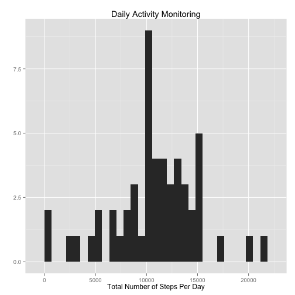
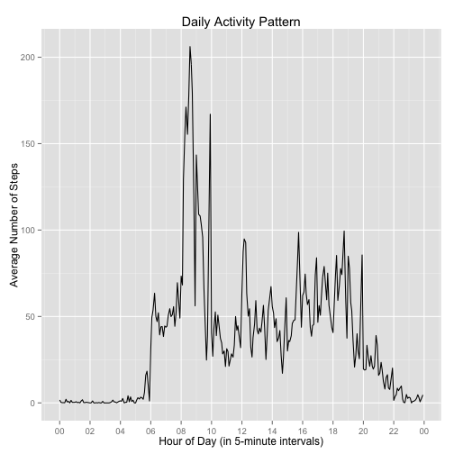
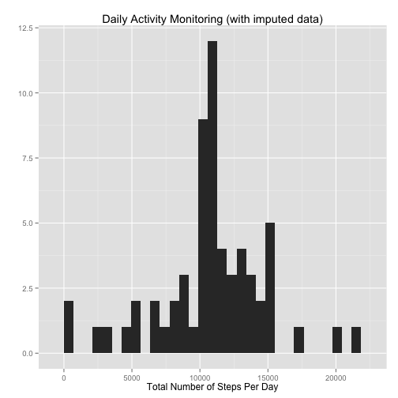
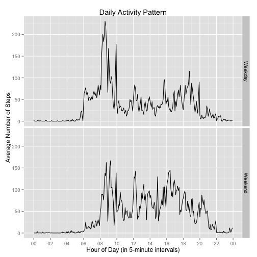

Reproducible Research - Project 1
========================================================


## Loading and preprocessing the data

```r
#read activity monitoring device data
activity = read.csv("activity.csv")
#process data - convert variable date to date format; sum steps by day
activity$date = as.Date(activity$date, "%Y-%m-%d") 
activity$hour = round(activity$interval/100, 0)
activity$min = ( (activity$interval/100) %% 1 ) * 100 
activity$time = strptime( paste(activity$hour, ":", activity$min, sep=""), format="%H:%M")  #POSIXlt var
activity$time = as.POSIXct(activity$time, format="%H:%M")  #convert to POSIXct var for use with aggregate()
sumsteps = aggregate(steps ~ date, data=activity, sum)
```


## What is mean total number of steps taken per day?

```r
library(xtable)
#histogram of total number of steps per day
p = ggplot(sumsteps, aes(steps)) + geom_histogram() + labs(x="Total Number of Steps Per Day") +
        labs(y="") + labs(title="Daily Activity Monitoring") 
print(p)
```

 

```r
#print mean and median of total number of steps per day
table1 = with(sumsteps, cbind(Mean=mean(steps, na.rm=TRUE), Median=median(steps, na.rm=TRUE)))
print(xtable(table1, caption="Number of Steps/Day"), type="html", include.rownames=FALSE, caption.placement="top")
```

<!-- html table generated in R 3.1.1 by xtable 1.7-3 package -->
<!-- Thu Nov 13 15:54:41 2014 -->
<TABLE border=1>
<CAPTION ALIGN="top"> Number of Steps/Day </CAPTION>
<TR> <TH> Mean </TH> <TH> Median </TH>  </TR>
  <TR> <TD align="right"> 10766.19 </TD> <TD align="right"> 10765.00 </TD> </TR>
   </TABLE>


## What is the average daily activity pattern?

```r
#time series plot of 5min intervals (x-axis) and avg number of steps (y-axis)
library(scales)
avgstepsi = aggregate(steps ~ time, data=activity, FUN=mean)
p = ggplot(data=avgstepsi, aes(x=time, y=steps)) + geom_line() + 
        labs(x="Hour of Day (in 5-minute intervals)") +
        labs(y="Average Number of Steps") + labs(title="Daily Activity Pattern") + 
        scale_x_datetime(breaks="2 hours", labels=date_format("%H"))
print(p)
```

 

```r
maxint = format(avgstepsi$time[avgstepsi$steps==max(avgstepsi$steps)], format="%H:%M")
```

The 5-minute interval with the maximum average number of steps is time 08:35.


## Imputing missing values
The imputation strategy used here is to replace the missing values with the mean for the 5-minute interval.


```r
library(xtable)
miss = dim( activity[!complete.cases(activity),])[1]
#create imputed data frame; all missing data is in the steps variable  
imputed = merge(activity, avgstepsi, by="time", all.x=TRUE)
imputed[is.na(imputed$steps.x), "steps.x"] = imputed[is.na(imputed$steps.x), "steps.y"]
names(imputed) = c("time", "steps", "date", "interval", "hour", "min", "steps.y")
impsum = aggregate(steps ~ date, data=imputed, sum)
#histogram of total number of steps per day
p = ggplot(impsum, aes(steps)) + geom_histogram() + labs(x="Total Number of Steps Per Day") +
        labs(y="") + labs(title="Daily Activity Monitoring (with imputed data)") 
print(p)
```

 

```r
#print mean and median of total number of steps per day
table2 = with(impsum, cbind(Mean=mean(steps, na.rm=TRUE), Median=median(steps, na.rm=TRUE)))
print(xtable(table2, caption="Number of Steps/Day (imputed data)"), type="html", include.rownames=FALSE, caption.placement="top")
```

<!-- html table generated in R 3.1.1 by xtable 1.7-3 package -->
<!-- Thu Nov 13 15:54:42 2014 -->
<TABLE border=1>
<CAPTION ALIGN="top"> Number of Steps/Day (imputed data) </CAPTION>
<TR> <TH> Mean </TH> <TH> Median </TH>  </TR>
  <TR> <TD align="right"> 10766.02 </TD> <TD align="right"> 10764.89 </TD> </TR>
   </TABLE>

### Summary:  Imputing Missing Values
The number of rows with missing data in the *activity.csv* data set is 2,410.  Imputing the missing data had little effect on the mean and medians of the total number of steps per day, with the mean and median differing by only 0.1707 and 0.1132, respectively.  The use of imputation did, however, increase the total number of steps by 86,119. 


## Are there differences in activity patterns between weekdays and weekends?

```r
imputed$wkday = factor(weekdays(imputed$date))
levels(imputed$wkday)[levels(imputed$wkday) %in% c("Saturday", "Sunday")] = "Weekend"
levels(imputed$wkday)[!levels(imputed$wkday) == "Weekend"] = "Weekday"
#panel plot - time series of 5min intervals (x-axis) and avg number of steps (y-axis)
avgstepsimp = aggregate(steps ~ time + wkday, data=imputed, FUN=mean)
p = ggplot(data=avgstepsimp, aes(x=time, y=steps)) + geom_line() + facet_grid(wkday ~ .) +
        labs(x="Hour of Day (in 5-minute intervals)") +
        labs(y="Average Number of Steps") + labs(title="Daily Activity Pattern") +
        scale_x_datetime(breaks="2 hours", labels=date_format("%H"))
print(p)
```

 
